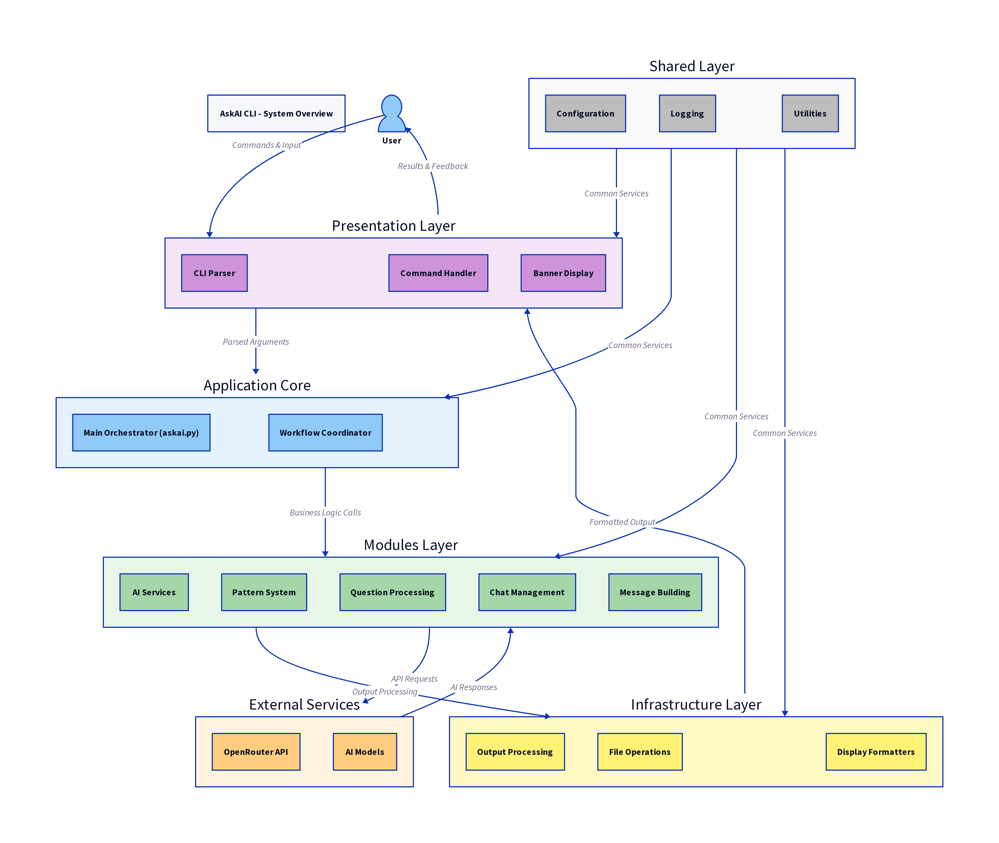
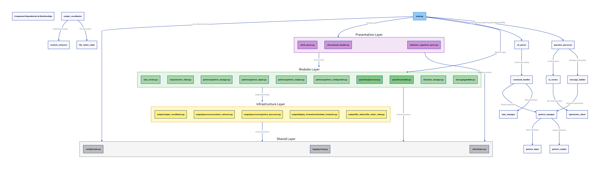
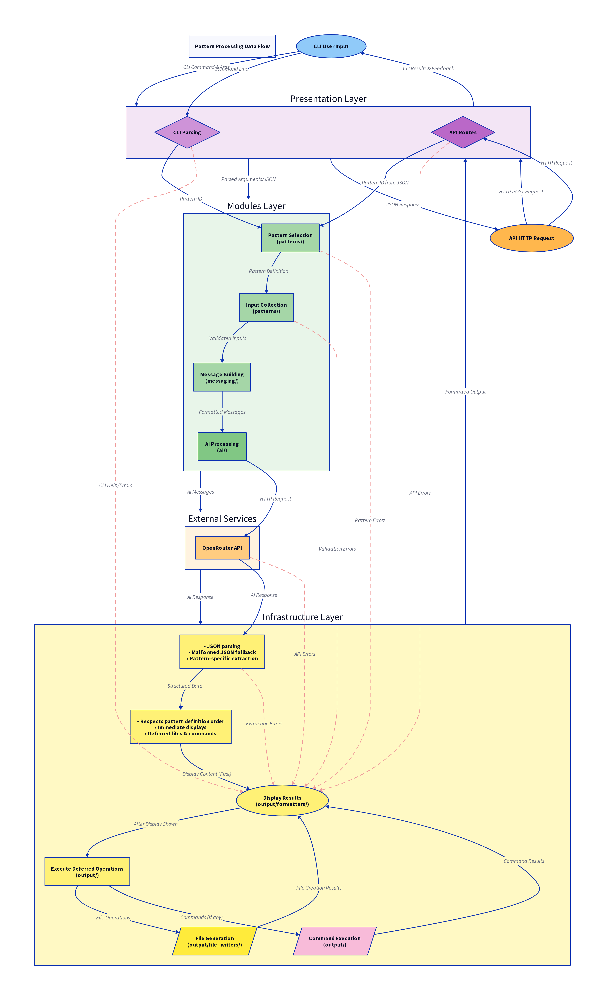
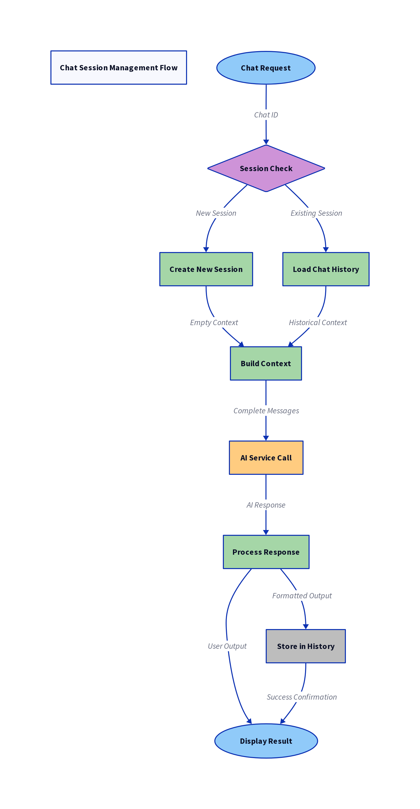
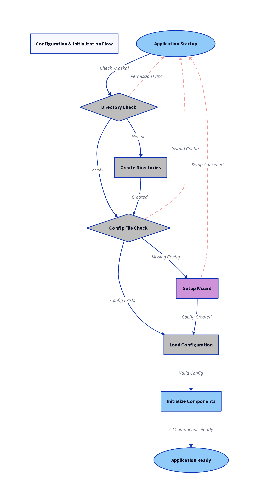
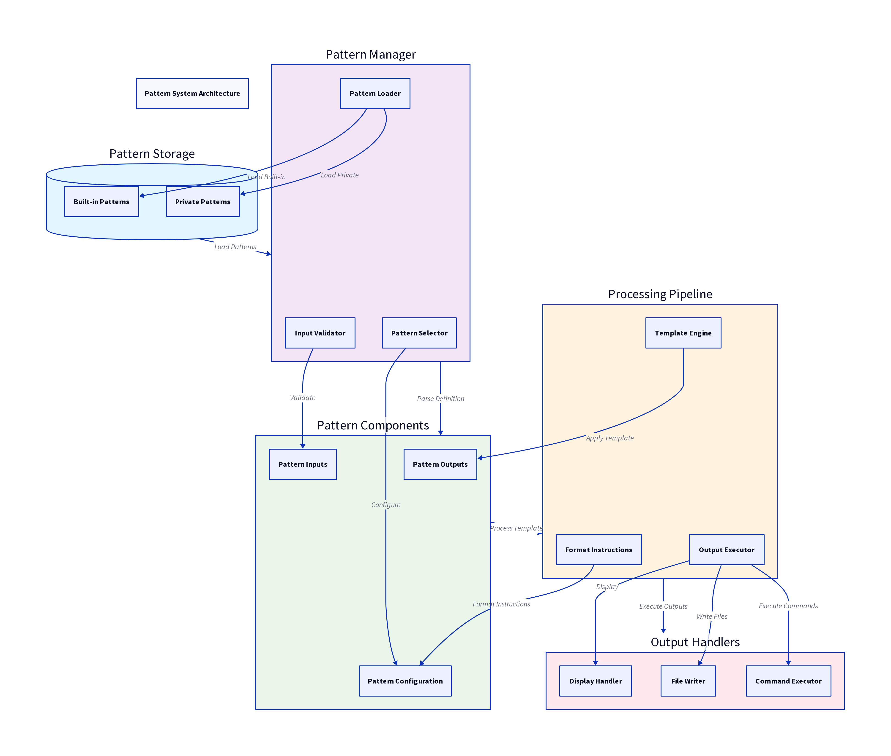
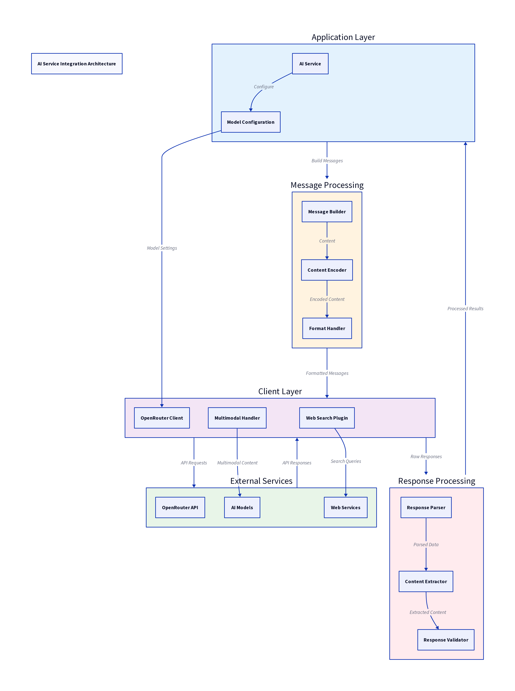
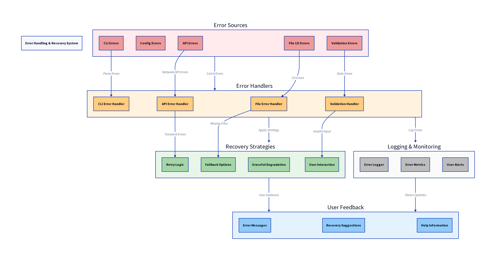

# AskAI CLI - Software Architecture Documentation

## Table of Contents
1. [System Overview](#system-overview)
2. [Architecture Layers](#architecture-layers)
3. [Core Components](#core-components)
4. [Data Flow](#data-flow)
5. [Module Dependencies](#module-dependencies)
6. [Design Patterns](#design-patterns)
7. [File Writing System - Chain of Responsibility](#file-writing-system---chain-of-responsibility)
8. [Output Processing Architecture](#output-processing-architecture)
9. [Configuration Management](#configuration-management)
10. [Extension Points](#extension-points)
11. [Security Considerations](#security-considerations)
12. [Performance & Scalability](#performance--scalability)

## System Overview

AskAI CLI is a sophisticated command-line interface application that provides AI-powered assistance through structured patterns and interactive conversations. The system integrates with multiple AI providers through the OpenRouter API and supports various input formats including text, images, PDFs, and URLs.

### Key Features
- **Pattern-based AI Interactions**: Pre-defined pattern templates for specific use cases
- **Multi-modal Input Support**: Text, images, PDFs, URLs
- **Persistent Chat Sessions**: Contextual conversations with history
- **Flexible Output Formats**: Raw text, JSON, Markdown with file export
- **Configuration Management**: YAML-based configuration with setup wizard
- **Extensible Architecture**: Plugin-ready design for custom patterns and formatters

### Target Users
- Developers and system administrators
- Content creators and analysts
- Technical consultants and solution architects
- Anyone requiring structured AI assistance via command line

## Architecture Layers

The system follows a layered architecture pattern with clear separation of concerns:

```
┌─────────────────────────────────────────────────────────────┐
│                    Presentation Layer                       │
│                   (CLI Interface)                          │
├─────────────────────────────────────────────────────────────┤
│                    Application Layer                        │
│              (Business Logic & Orchestration)              │
├─────────────────────────────────────────────────────────────┤
│                     Service Layer                          │
│          (AI Services, Pattern Management, I/O)            │
├─────────────────────────────────────────────────────────────┤
│                  Infrastructure Layer                      │
│         (Configuration, Logging, File System)              │
└─────────────────────────────────────────────────────────────┘
```

### Layer Responsibilities

**Presentation Layer**: Command-line argument parsing, user interaction, help display
**Application Layer**: Main orchestration logic, workflow coordination, component initialization
**Service Layer**: AI communication, pattern processing, output handling, chat management
**Infrastructure Layer**: Configuration loading, logging, file I/O, system integration

## Core Components

### 1. Main Application (`askai.py`)
**Purpose**: Application entry point and orchestration hub
**Responsibilities**:
- Initialize and coordinate all components
- Handle command routing and workflow selection
- Manage application lifecycle
- Integrate pattern and chat processing flows

### 2. Shared Infrastructure Package (`shared/`)
**Components**:
- `config/loader.py`: Configuration management and setup wizard
- `logging/setup.py`: Logging infrastructure and formatting
- `utils/helpers.py`: File operations, encoding, and utilities

**Responsibilities**:
- Provide common infrastructure services
- Manage application configuration and logging
- Supply shared utilities for file operations and formatting
- Support application-wide constants and settings

### 3. Presentation Layer Package (`presentation/cli/`)
**Components**:
- `CLIParser`: Argument parsing and validation
- `CommandHandler`: Command execution routing
- `BannerArgumentParser`: Enhanced help display

**Responsibilities**:
- Parse and validate command-line arguments
- Route commands to appropriate handlers
- Provide comprehensive help and documentation
- Handle user interaction and interface presentation

### 4. Core Modules Package (`modules/`)

#### AI Service Module (`modules/ai/`)
**Components**:
- `AIService`: High-level AI interaction coordinator
- `OpenRouterClient`: API client for OpenRouter service

**Responsibilities**:
- Manage AI model configuration and selection
- Handle API communication with error recovery
- Support multimodal inputs (text, images, PDFs)
- Implement web search capabilities

#### Pattern Management Module (`modules/patterns/`)
**Components**:
- `PatternManager`: Pattern lifecycle management
- `PatternInput`: Input definition and validation
- `PatternOutput`: Output specification and behavior
- `PatternConfiguration`: Model and execution settings

**Responsibilities**:
- Load and parse pattern definitions
- Validate input requirements
- Define output behaviors and file generation
- Support both built-in and private patterns

#### Question Processing Module (`modules/questions/`) - NEW
**Components**:
- `QuestionProcessor`: Standalone question processing logic
- `models.py`: Question data models and structures

**Responsibilities**:
- Handle standalone question processing separate from patterns
- Manage question-specific logic and validation
- Provide clean separation between pattern and question workflows
- Support various input formats for questions

#### Chat Management Module (`modules/chat/`)
**Components**:
- `ChatManager`: Chat session lifecycle management

**Responsibilities**:
- Maintain persistent conversation history
- Support chat context loading and storage
- Provide chat file management utilities

#### Messaging Module (`modules/messaging/`)
**Components**:
- `MessageBuilder`: Construct AI conversation messages

**Responsibilities**:
- Build message structures for different input types
- Handle multimodal content encoding
- Apply pattern templates and format instructions
- Support URL and file content integration

### 5. Infrastructure Layer Package (`infrastructure/output/`)
**Components**:
- `OutputCoordinator`: Main facade coordinating all output operations
- **Processors Package** (`processors/`): Specialized content processing
  - `ContentExtractor`: Extract and validate content from AI responses
  - `PatternProcessor`: Handle pattern-specific output generation
  - `ResponseNormalizer`: Clean and normalize response content
  - `DirectoryManager`: Manage output directory operations
- **Display Formatters Package** (`display_formatters/`): Content presentation
  - `TerminalFormatter`: CLI output with colors and syntax highlighting
  - `MarkdownFormatter`: Markdown file formatting with proper syntax
  - `BaseDisplayFormatter`: Abstract base for all display formatters
- **File Writers Package** (`file_writers/`): Chain of Responsibility for file operations
  - `FileWriterChain`: Orchestrates file writing through specialized writers
  - `HTMLWriter`, `CSSWriter`, `JavaScriptWriter`: Web content writers
  - `MarkdownWriter`, `JSONWriter`, `TextWriter`: Document writers
  - `BaseFileWriter`: Abstract base for all file writers

**Responsibilities**:
- **OutputCoordinator**: Unified entry point for all output operations
- **Processors**: Content extraction, pattern handling, normalization, directory management
- **Display Formatters**: Terminal and file content presentation with proper formatting
- **File Writers**: Specialized file creation based on content type using Chain of Responsibility
- Support both pattern-based and standard output flows
- Maintain separation of concerns between processing, formatting, and file operations
**Purpose**: Application configuration management
**Responsibilities**:
- Load YAML configuration files
- Run interactive setup wizard
- Manage environment-specific configurations
- Handle directory structure initialization

## Data Flow

### Pattern-Based Processing Flow
```
User Input → CLI Parser (presentation/cli) → Pattern Selection (modules/patterns) →
Input Collection → Message Building (modules/messaging) → AI Service (modules/ai) →
OpenRouter API → Response Processing → Output Handler (infrastructure/output) →
Pattern Output Processing → File Generation/Display
```

### Question-Based Processing Flow (NEW)
```
User Input → CLI Parser (presentation/cli) → Question Processing (modules/questions) →
Message Building (modules/messaging) → AI Service (modules/ai) → OpenRouter API →
Response Processing → Output Handler (infrastructure/output) → Standard Formatting → Display
```

### Chat-Based Processing Flow
```
User Input → CLI Parser (presentation/cli) → Chat Session Setup (modules/chat) →
Context Loading → Message Building (modules/messaging) → AI Service (modules/ai) →
OpenRouter API → Response Processing → Output Handler (infrastructure/output) →
Standard Formatting → Chat History Storage
```

### Configuration Flow
```
Startup → Directory Check (shared/utils) → Config File Check (shared/config) →
Setup Wizard (if needed) → Configuration Loading → Component Initialization
```

### Cross-Layer Communication
- **Presentation Layer**: Receives user input, routes to appropriate modules
- **Modules Layer**: Processes business logic, coordinates between AI services and patterns
- **Infrastructure Layer**: Handles output processing, file operations, and external integrations
- **Shared Layer**: Provides common services (config, logging, utilities) to all layers

## Module Dependencies

### Dependency Hierarchy
```
askai.py (main)
├── shared/
│   ├── config/loader.py (Configuration management)
│   ├── logging/setup.py (Logging infrastructure)
│   └── utils/helpers.py (File operations, utilities)
├── presentation/cli/
│   ├── cli_parser.py (Argument parsing)
│   ├── command_handler.py (Command routing)
│   └── banner_argument_parser.py (Enhanced help)
├── modules/
│   ├── ai/ (AIService, OpenRouterClient)
│   ├── patterns/ (PatternManager, PatternInput, PatternOutput, PatternConfiguration)
│   ├── questions/ (QuestionProcessor, models)
│   ├── chat/ (ChatManager)
│   └── messaging/ (MessageBuilder)
└── infrastructure/output/
    ├── output_coordinator.py (Main facade)
    ├── processors/ (ContentExtractor, PatternProcessor, ResponseNormalizer, DirectoryManager)
    ├── display_formatters/ (TerminalFormatter, MarkdownFormatter, BaseDisplayFormatter)
    └── file_writers/ (FileWriterChain + specialized writers)
```

### Layer Dependencies
- **Presentation** → **Modules** → **Infrastructure**
- **All Layers** → **Shared** (common infrastructure)
- **Clear separation**: No circular dependencies
- **Upward flow**: Presentation calls modules, modules call infrastructure
- **Shared services**: Configuration, logging, utilities available to all layers

### External Dependencies
- **requests**: HTTP API communication
- **PyYAML**: Configuration file parsing
- **tqdm**: Progress indicators
- **PIL/Pillow**: Image processing
- **pypdf**: PDF text extraction

## Design Patterns

### 1. Facade Pattern
- `AIService` provides simplified interface to complex AI operations
- `OutputCoordinator` abstracts output processing complexity behind a unified interface

### 2. Strategy Pattern
- Different display formatters for various output types (terminal, markdown)
- Specialized processors for different content processing needs
- Model configuration strategies for different AI providers

### 3. Template Method Pattern
- Pattern processing follows defined template structure
- Output handling uses consistent processing steps

### 4. Chain of Responsibility Pattern
- `FileWriterChain` processes files through specialized writers based on content type
- Each writer handles specific file types and delegates to the next in chain

### 4. Factory Pattern
- Dynamic component initialization based on command requirements
- Pattern selection and instantiation

### 5. Chain of Responsibility Pattern
- `FileWriterChain` routes file operations to specialized writers
- Each writer handles specific file extensions and passes unhandled requests to the next writer
- Enables extensible file handling with clear separation of concerns

### 6. Observer Pattern
- Logging system observes operations across components
- Progress tracking during long-running operations

## File Writing System - Chain of Responsibility

The AskAI CLI implements a sophisticated file writing system based on the Chain of Responsibility design pattern. This architecture replaced a monolithic `FileWriter` class with a modular, extensible system that handles different file types through specialized writers.

### Architecture Overview

The file writing system consists of three main layers:

```
OutputCoordinator
    ↓
FileWriterChain (Coordinator)
    ↓
Specialized Writers (HTML, CSS, JS, JSON, Markdown, Text)
```

### Core Components

#### 1. FileWriterChain - The Coordinator
**Location**: `python/output/file_writers/file_writer_chain.py`

The `FileWriterChain` acts as the main coordinator and entry point for all file writing operations:

```python
class FileWriterChain:
    def __init__(self):
        # Build the chain: HTML → CSS → JS → JSON → Markdown → Text

    def write_by_extension(self, content: str, file_extension: str, output_path: str) -> Optional[str]
    def write_file(self, content: str, content_type: str, output_path: str) -> Optional[str]
```

**Key Features**:
- **Extension-based routing**: Automatically routes files based on their extension
- **Content-type routing**: Supports explicit content type specification from patterns
- **Chain initialization**: Sets up the complete chain of specialized writers
- **Backward compatibility**: Maintains `write_by_extension()` for existing code

#### 2. BaseWriter - The Abstract Foundation
**Location**: `python/output/file_writers/base_writer.py`

All specialized writers inherit from `BaseWriter`, which implements the Chain of Responsibility pattern:

```python
class BaseWriter:
    def __init__(self, next_writer: Optional['BaseWriter'] = None)
    def write(self, content: str, file_extension: str, output_path: str) -> Optional[str]
    def can_handle(self, file_extension: str) -> bool  # Abstract method
    def _clean_content(self, content: str) -> str      # Common content cleaning
    def _write_file_safely(self, content: str, output_path: str) -> str  # Safe file writing
```

**Pattern Implementation**:
- Each writer checks if it can handle the file type via `can_handle()`
- If yes, processes the content and writes the file
- If no, passes the request to the next writer in the chain
- Provides common functionality for content cleaning and safe file writing

#### 3. Specialized Writers

Each writer is focused on a single responsibility and optimized for specific content types:

##### HTMLWriter (`html_writer.py`)
- **Handles**: `.html`, `.htm` files
- **Features**:
  - Document structure validation
  - Automatic `<!DOCTYPE html>` addition if missing
  - Reference injection for related files (CSS/JS)
  - Content cleaning and formatting

##### CSSWriter (`css_writer.py`)
- **Handles**: `.css` files
- **Features**:
  - Selector cleaning and validation
  - Automatic header comments with generation timestamp
  - CSS syntax formatting
  - Comment preservation

##### JavaScriptWriter (`js_writer.py`)
- **Handles**: `.js` files
- **Features**:
  - Automatic `'use strict';` directive addition
  - DOM ready wrapper for UI code
  - Function extraction and formatting
  - Code structure optimization

##### JSONWriter (`json_writer.py`)
- **Handles**: `.json` files
- **Features**:
  - JSON validation and formatting
  - Automatic parsing and pretty-printing
  - Error handling for malformed JSON
  - Structure validation

##### MarkdownWriter (`markdown_writer.py`)
- **Handles**: `.md` files
- **Features**:
  - Heading structure validation
  - List formatting optimization
  - Link validation
  - Metadata preservation

##### TextWriter (`text_writer.py`)
- **Handles**: `.txt` files and **fallback for all other extensions**
- **Features**:
  - Basic text cleaning
  - Encoding handling
  - Universal fallback functionality
  - Preserves original content structure

### Chain Flow Example

When a file needs to be written:

1. **OutputCoordinator** calls `FileWriterChain.write_by_extension("content", ".css", "/path/to/styles.css")`
2. **FileWriterChain** starts the chain with HTMLWriter
3. **HTMLWriter** checks: Can I handle `.css`? → No → Pass to next
4. **CSSWriter** checks: Can I handle `.css`? → Yes → Process and write file
5. **Result** returned: Path to written file or error message

### Benefits of the Chain Architecture

#### 1. **Single Responsibility Principle**
Each writer handles only one file type, making code more maintainable and testable.

#### 2. **Open/Closed Principle**
New file types can be added by creating new writers without modifying existing code.

#### 3. **Extensibility**
Easy to add support for new file formats:
```python
class PythonWriter(BaseWriter):
    def can_handle(self, file_extension: str) -> bool:
        return file_extension.lower() in ['.py']

    def write(self, content: str, file_extension: str, output_path: str) -> Optional[str]:
        # Python-specific processing
        pass
```

#### 4. **Content-Type Awareness**
Unlike the old system that guessed from file extensions, the new system uses explicit content types from pattern definitions.

#### 5. **Consistent Error Handling**
Each writer implements robust error handling with detailed logging and user feedback.

### Integration with Pattern System

The file writing system integrates seamlessly with the pattern system:

```python
# Pattern defines explicit content types
outputs:
  - name: "website_preview"
    type: "file"
    content_type: "html"
    filename: "index.html"

  - name: "styles"
    type: "file"
    content_type: "css"
    filename: "styles.css"
```

The `OutputCoordinator` uses these content types to route to the appropriate writer, ensuring optimal processing for each file type.

### Performance Considerations

- **Lazy Chain Building**: Writers are only instantiated when needed
- **Early Exit**: Chain stops at the first writer that can handle the file type
- **Memory Efficient**: Each writer processes content in-place without duplication
- **Atomic Writes**: All file operations are atomic to prevent corruption

### Testing Strategy

Each writer is independently testable:
- **Unit Tests**: Individual writer behavior and content processing
- **Integration Tests**: Complete chain functionality
- **Content Tests**: Validation of output quality for each file type

### CLI Integration with `-q` and `-o` Flags

The file writing system seamlessly integrates with the command-line interface, particularly with the question (`-q`) and output directory (`-o`) flags:

#### Question Mode with Output Directory
```bash
# Basic question with output directory
askai -q "Create a simple HTML page with CSS" -o ./my-website

# Multi-modal question with file output
askai -q "Analyze this image and create documentation" -img photo.jpg -o ./analysis

# Question with specific format and output
askai -q "Generate API documentation" -f json -o ./docs/api.json
```

#### How it Works

1. **Command Parsing**: The `CLIParser` processes `-q` and `-o` arguments
2. **Output Directory Setup**: If `-o` is specified, the `OutputCoordinator` is configured with the target directory
3. **Content Processing**: The AI response is processed through the normal flow
4. **File Writing**: The `FileWriterChain` automatically routes content to appropriate writers based on file extensions

#### Integration Flow
```
User Command: -q "Create website" -o ./site
    ↓
CLIParser extracts question and output directory
    ↓
OutputCoordinator.output_dir = "./site"
    ↓
AI generates response (HTML, CSS, JS content)
    ↓
OutputCoordinator._write_to_file() called for each content type
    ↓
FileWriterChain.write_by_extension() routes to:
  - HTMLWriter for .html files
  - CSSWriter for .css files
  - JavaScriptWriter for .js files
    ↓
Files created in ./site/ directory
```

#### Automatic File Type Detection

The system automatically determines file types and applies appropriate processing:

- **HTML Content**: Routed to `HTMLWriter` → Document structure validation, DOCTYPE addition
- **CSS Content**: Routed to `CSSWriter` → Selector cleaning, header comments
- **JavaScript**: Routed to `JavaScriptWriter` → 'use strict' addition, DOM ready wrapping
- **JSON Data**: Routed to `JSONWriter` → Validation, pretty-printing
- **Markdown**: Routed to `MarkdownWriter` → Heading structure, list formatting
- **Other Text**: Routed to `TextWriter` → Basic text cleaning

#### Format-Specific Output

When using format flags (`-f`), the system respects the user's choice:

```bash
# Force JSON output format
askai -q "Create data structure" -f json -o ./data.json
# → Uses JSONWriter for validation and formatting

# Force Markdown output
askai -q "Write documentation" -f md -o ./docs.md
# → Uses MarkdownWriter for proper structure
```

#### Error Handling and Safety

- **Directory Creation**: Automatically creates output directories if they don't exist
- **Path Validation**: Prevents directory traversal attacks
- **Atomic Writes**: Ensures file integrity during write operations
- **Permission Handling**: Graceful handling of permission issues
- **Fallback Behavior**: Falls back to TextWriter for unknown file types

#### Pattern Integration

The system works seamlessly with both standalone questions and pattern-based operations:

```bash
# Standalone question (uses -q/-o integration)
askai -q "Build a calculator app" -o ./calculator

# Pattern-based (uses pattern-defined outputs)
askai -up website_generator -o ./my-site
```

This integration ensures that users get the same high-quality, specialized file processing whether they're using simple questions or complex pattern templates.

This architecture provides a robust, maintainable, and extensible foundation for file handling in the AskAI CLI system.

## Output Processing Architecture

The AskAI CLI has been refactored from a monolithic output handling approach to a modular, specialized architecture that separates concerns between content processing, display formatting, and file operations with enhanced deferred execution capabilities.

### Architecture Overview

```
OutputCoordinator (Facade & Orchestrator)
    ├── ContentExtractor (Enhanced Response Processing with Malformed JSON Support)
    ├── PatternProcessor (Streamlined Pattern Content Extraction)
    ├── ResponseNormalizer (Content Cleaning)
    ├── DirectoryManager (File System Operations)
    ├── TerminalFormatter (CLI Display)
    ├── MarkdownFormatter (File Formatting)
    └── FileWriterChain (File Operations)

Deferred Execution Flow:
    Display Processing → Content Presentation → Pending Operations → Execute Commands/Files
```

### Core Components

#### 1. OutputCoordinator - Main Facade & Orchestrator
**Location**: `python/output/output_coordinator.py`

The `OutputCoordinator` serves as the unified entry point for all output operations and orchestrates the new deferred execution pattern:

**Key Responsibilities**:
- Coordinate between processors, formatters, and file writers
- Implement deferred execution pattern for proper output ordering
- Store pending operations (commands and file creations) for after-display execution
- Manage the overall output workflow with proper sequencing
- Handle quiet mode and output directory configuration
- Provide a clean interface for the main application

**New Deferred Execution Features**:
- `_store_file_creation_info()`: Stores file operations for later execution
- `execute_pending_operations()`: Executes stored commands and file operations after display
- `pending_files`: Storage for deferred file creation operations
- Pattern content processing with proper ordering (explanation → execution → file creation)

#### 2. Content Processors Package
**Location**: `python/output/processors/`

##### ContentExtractor (`content_extractor.py`) - Enhanced
- **Enhanced JSON Parsing**: Handles both JSON strings and pre-parsed response structures
- **Malformed JSON Support**: Regex-based fallback for responses with unescaped quotes
- **Response Structure Detection**: Automatically detects and processes `response['results']` format
- **Robust Error Handling**: Multiple fallback mechanisms for content extraction
- **Public Content Cleaning**: `clean_escaped_content()` method now public for reuse

**Key Methods**:
- `extract_structured_data()`: Enhanced to handle dict responses and malformed JSON
- `_extract_from_malformed_json()`: New regex-based JSON extraction for broken responses
- `_extract_json_from_text()`: Improved to detect pre-parsed structures

##### PatternProcessor (`pattern_processor.py`) - Streamlined
- **Single Content Extraction**: Extracts pattern contents once for reuse across operations
- **Simplified Processing**: Removed duplicate content processing, focuses on extraction
- **Public Interface**: `extract_pattern_contents()` now public for coordinator access
- **Command Execution Integration**: Maintains integration with `PatternOutput.execute_command()`

**Workflow**:
1. Extract content once using `ContentExtractor`
2. Provide extracted content to `OutputCoordinator` for processing
3. Support both display and execution operations with shared content

##### ResponseNormalizer (`response_normalizer.py`)
- Cleans and normalizes AI response content
- Removes unwanted formatting artifacts
- Ensures consistent content structure

##### DirectoryManager (`directory_manager.py`)
- Manages output directory creation and validation
- Handles path resolution and permission checking
- Ensures secure file system operations

#### 3. Display Formatters Package
**Location**: `python/output/display_formatters/`

##### TerminalFormatter (`terminal_formatter.py`)
- Formats content for terminal/CLI display
- Provides ANSI color codes and syntax highlighting
- Supports rich markdown rendering with fallback options
- Handles various content types (JSON, JavaScript, HTML, CSS)

##### MarkdownFormatter (`markdown_formatter.py`)
- Formats content for markdown file output
- Ensures proper markdown syntax and structure
- Validates and fixes broken markdown elements

##### BaseDisplayFormatter (`base_display_formatter.py`)
- Abstract base class for all display formatters
- Provides common functionality like content truncation
- Defines the formatter interface contract

### Enhanced Processing Flow

#### Deferred Execution Pattern
The new architecture implements a deferred execution pattern to ensure proper output ordering:

1. **Content Extraction**: Extract all pattern contents once using enhanced `ContentExtractor`
2. **Display Processing**: Format and display explanations/content using `TerminalFormatter`
3. **Pending Operations Storage**: Store command executions and file creations for later
4. **Deferred Execution**: Execute stored operations after display is complete

This ensures users see explanations before commands execute and maintains proper sequence.

#### Malformed JSON Handling
The enhanced `ContentExtractor` handles AI responses with malformed JSON:

1. **Standard JSON Parsing**: Attempts normal JSON parsing first
2. **Pre-parsed Detection**: Checks for response structures with 'results' key
3. **Regex Fallback**: Uses regex to extract JSON from responses with unescaped quotes
4. **Error Recovery**: Multiple fallback mechanisms ensure content extraction succeeds

### Benefits of the Enhanced Architecture

#### Deferred Execution Benefits
- **Proper Output Ordering**: Explanations always appear before command execution
- **User Experience**: Users can read explanations while commands are prepared
- **Security**: Commands are clearly visible before execution with confirmation prompts
- **Flexibility**: Supports complex patterns with multiple operations in correct sequence

#### Robust Content Extraction
- **AI Response Resilience**: Handles various AI response formats including malformed JSON
- **Reduced Processing**: Single content extraction eliminates duplicate work
- **Error Recovery**: Multiple fallback mechanisms ensure extraction success
- **Format Flexibility**: Supports both string and pre-parsed response formats

#### Separation of Concerns
- **Processing**: Content extraction and normalization with enhanced error handling
- **Formatting**: Display and file presentation
- **Writing**: File system operations
- **Orchestration**: Deferred execution and proper sequencing

#### Modularity and Maintainability
- Each component has a single, well-defined responsibility
- Easy to test individual components in isolation
- Clear interfaces between components
- Enhanced error handling and recovery mechanisms

#### Extensibility
- New processors can be added for different content types
- New formatters can be implemented for different output targets
- File writers can be extended for new file types
- Deferred execution pattern supports complex workflow extensions

#### Code Quality Improvements
- Reduced from 1500-line monolithic class to ~200-line coordinator
- Individual specialized components are focused and compact
- Eliminated code duplication and improved reusability
- Enhanced error handling and user feedback

### Migration Benefits

The enhanced refactoring achieved:
- **53% code reduction** in the output handling system
- **Improved maintainability** through single responsibility principle
- **Enhanced testability** with isolated, focused components
- **Better extensibility** for future enhancements
- **Clearer code organization** with purpose-specific packages
- **Robust error handling** for real-world AI response variations
- **Improved user experience** through proper output sequencing

## Configuration Management

### Configuration Structure
```yaml
# Core API Configuration
api_key: "your-openrouter-key"
base_url: "https://openrouter.ai/api/v1"
default_model: "anthropic/claude-3-haiku"

# Model Configurations
default_vision_model: "anthropic/claude-3-haiku"
default_pdf_model: "anthropic/claude-3-haiku"

# System Paths
log_path: "~/.askai/logs/askai.log"
private_patterns_path: "~/askai-patterns"

# Chat Configuration
chat:
  storage_path: "~/.askai/chats"
  max_history: 50

# Web Search Configuration
web_search:
  enabled: false
  method: "plugin"
  max_results: 5

# Logging Configuration
logging:
  level: "INFO"
  max_file_size: "10MB"
  backup_count: 5
```

### Configuration Features
- **YAML-based**: Human-readable configuration format
- **Setup Wizard**: Interactive configuration creation
- **Environment Support**: Test and production configurations
- **Validation**: Configuration validation with helpful error messages
- **Hot Reload**: Configuration changes without restart (where applicable)

## Extension Points

### 1. Custom Patterns
- Add new patterns in private patterns directory
- Follow standard pattern markdown format
- Support custom input types and output formats

### 2. Output Formatters
- Implement new formatters in `output/display_formatters/`
- Support custom display and file generation logic
- Register new formats in OutputCoordinator

### 3. AI Providers
- Extend AIService for new provider support
- Implement provider-specific clients
- Add configuration options for new providers

### 4. Input Processors
- Add support for new file types in MessageBuilder
- Implement custom content encoders
- Extend multimodal capabilities

## Security Considerations

### 1. API Key Management
- Store API keys in secure configuration files
- Support environment variable overrides
- Warn against hardcoding sensitive data

### 2. File System Access
- Validate file paths to prevent directory traversal
- Restrict file operations to designated directories
- Sanitize user input for file operations

### 3. Command Execution
- Require explicit user confirmation for command execution
- Display commands before execution
- Implement command validation and sanitization

### 4. Input Validation
- Validate all user inputs before processing
- Sanitize file content before AI submission
- Implement size limits for file uploads

### 5. Logging Security
- Avoid logging sensitive information (API keys, personal data)
- Implement log rotation to manage disk usage
- Secure log file permissions

## Performance & Scalability

### 1. Lazy Loading
- Initialize components only when needed
- Load patterns on-demand
- Cache frequently accessed data

### 2. Async Operations
- Use threading for progress indicators
- Support background processing where appropriate
- Implement request timeouts and retries

### 3. Memory Management
- Stream large file processing
- Implement content size limits
- Clean up temporary resources

### 4. Caching Strategy
- Cache pattern metadata
- Store configuration in memory after loading
- Implement response caching for repeated queries

### 5. Resource Optimization
- Minimize API calls through intelligent batching
- Compress large payloads where possible
- Implement connection pooling for HTTP requests

### 6. Error Handling
- Graceful degradation for non-critical failures
- Comprehensive error reporting with context
- Automatic retry logic with exponential backoff

---
## Component Interaction Diagrams

The following diagrams illustrate key aspects of the AskAI CLI architecture. Each PNG is generated from its corresponding D2 file in `docs/drawings/`.

**High-level System Architecture**


**Component Relationships and Dependencies**


**Pattern Processing Workflow**


**Chat Session Management**


**Configuration and Initialization Flow**


**Pattern System Detailed Architecture**


**AI Service Integration Architecture**


**Error Handling and Recovery System**


This architecture supports the current feature set while providing clear extension points for future enhancements. The modular design ensures maintainability and testability while the layered approach provides clear separation of concerns.
